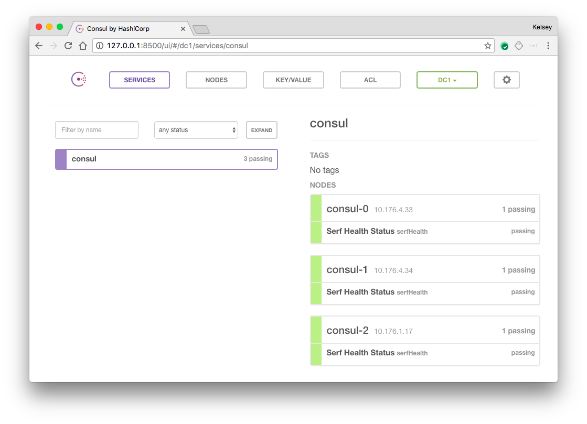

# Running Consul on Kubernetes

This tutorial will walk you through deploying a three (3) node [Consul](https://www.consul.io) cluster on Kubernetes.

## Overview

* Three (3) node Consul cluster using a StatefulSet
* Cluster bootstrapping (consul join) using a Job
* Secure communication between Consul members

## Prerequisites

This tutorial leverages features available in Kubernetes 1.5.1 and later.

* [kubernetes](http://kubernetes.io/docs/getting-started-guides/binary_release) 1.5.x

The following clients must be installed on the machine used to follow this tutorial:

* [consul](https://www.consul.io/downloads.html) 0.7.2
* [cfssl](https://pkg.cfssl.org) and [cfssljson](https://pkg.cfssl.org) 1.2

## Usage

Clone this repo:

```
git clone https://github.com/kelseyhightower/consul-on-kubernetes.git
```

Change into the `consul-on-kubernetes` directory:

```
cd consul-on-kubernetes
```

### Generate TLS Certificates

Communication between each Consul member will be encrypted using TLS.

Initialize a Certificate Authority (CA):

```
cfssl gencert -initca ca/ca-csr.json | cfssljson -bare ca
```

Create the Consul TLS certificate and private key:

```
cfssl gencert \
  -ca=ca.pem \
  -ca-key=ca-key.pem \
  -config=ca/ca-config.json \
  -profile=default \
  ca/consul-csr.json | cfssljson -bare consul
```

The `cfssl gencert` command will generate the following files:

```
ca-key.pem
ca.pem
consul-key.pem
consul.pem
```

### Generate the Consul Gossip Encryption Key

Communication between Consul members using the Serf gossip protocol will be encrypted using a shared encryption key.

Generate and store an encrypt key using the `consul keygen` command:

```
CONSUL_GOSSIP_ENCRYPTION_KEY=$(consul keygen)
```

### Create the Consule Secret and Configmap

The Consul cluster will be configured using a combination of CLI flags, TLS certs, and a configuration file.

Store the gossip encryption key and TLS certs in a Secret:

```
kubectl create secret generic consul \
  --from-literal="gossip-encryption-key=${CONSUL_GOSSIP_ENCRYPTION_KEY}" \
  --from-file=ca.pem \
  --from-file=consul.pem \
  --from-file=consul-key.pem
```

Store the Consul server configuration file in a ConfigMap:

```
kubectl create configmap consul --from-file=configs/server.json
```

### Create the Consul Service

Create a headless service to expose each Consul member internally to the cluster:

```
kubectl create -f services/consul.yaml
```

### Create the Consul StatefulSet

Deploy a three (3) node Consul cluster using a StatefulSet:

```
kubectl create -f statefulsets/consul.yaml
```

Each consul member will be created one by one. Verify each member is `Running` before moving to the next step.

```
kubectl get pods
```
```
NAME       READY     STATUS    RESTARTS   AGE
consul-0   1/1       Running   0          50s
consul-1   1/1       Running   0          29s
consul-2   1/1       Running   0          15s
```

### Join the Consul Cluster Members

At this point each consul member is up and running. Start the `consul-join` job to complete the cluster bootstrapping process.

```
kubectl create -f jobs/consul-join.yaml
```

```
kubectl get jobs
```
```
NAME          DESIRED   SUCCESSFUL   AGE
consul-join   1         1            33s
```

### Verification

```
kubectl logs consul-0
```

```
kubectl port-forward consul-0 8400:8400
```
```
Forwarding from 127.0.0.1:8400 -> 8400
Forwarding from [::1]:8400 -> 8400
```

```
consul members
```
```
Node      Address           Status  Type    Build  Protocol  DC
consul-0  10.176.4.30:8301  alive   server  0.7.2  2         dc1
consul-1  10.176.4.31:8301  alive   server  0.7.2  2         dc1
consul-2  10.176.1.16:8301  alive   server  0.7.2  2         dc1
```

### Accessing the Web UI

```
kubectl port-forward consul-0 8500:8500
```

Visit http://127.0.0.1:8500



## Cleanup

Run the `cleanup` script to remove the Kubernetes resources created during this tutorial:

```
bash cleanup
```
